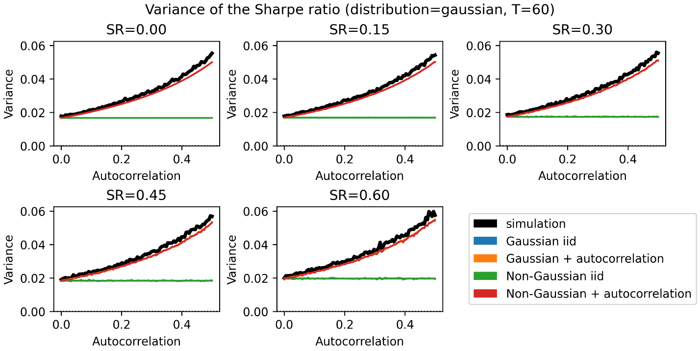
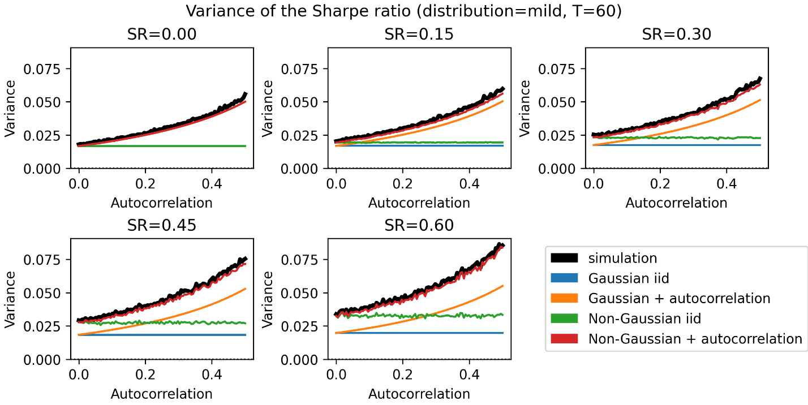
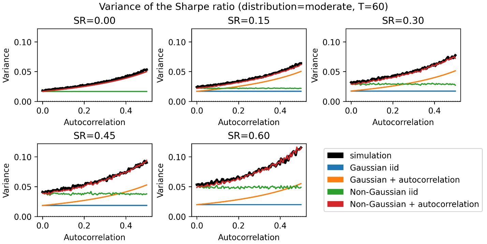
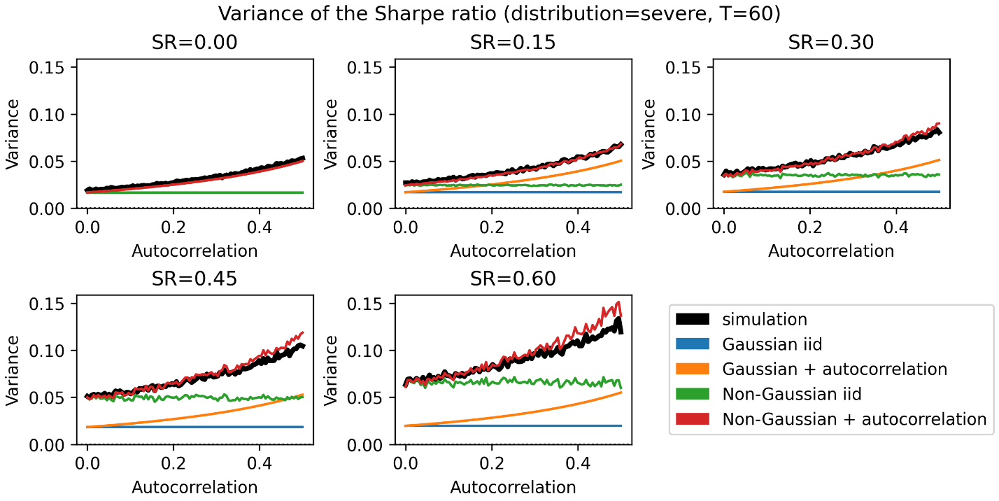
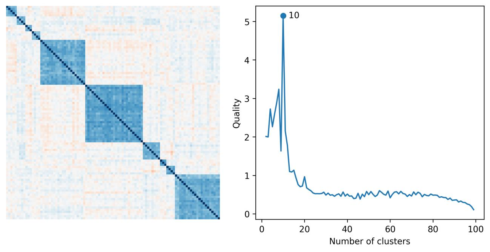
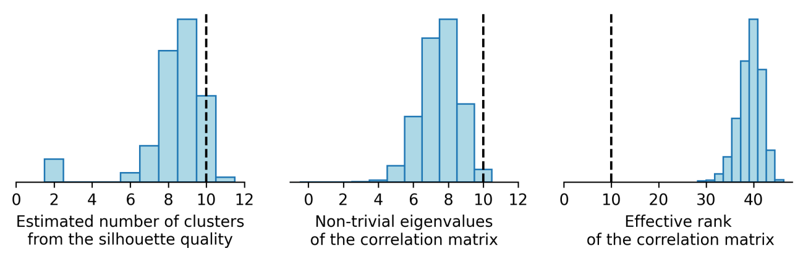

# How to Use the Sharpe Ratio

**Authors**: Marcos López de Prado, Alexander Lipton, and Vincent Zoonekynd

**Source**: ADIA Lab Research Paper Series, No. 19 · March 7, 2026

**Replication code**: <https://github.com/zoonek/2025-sharpe-ratio>

---

## Abstract

The Sharpe ratio is the dominant metric for evaluating investment skill, yet inference based on it is routinely flawed—often leading to false confidence, incorrect conclusions, and costly decisions. This paper proposes a new standard for Sharpe ratio inference and reporting by diagnosing common sources of error and providing practical corrections grounded in modern statistical theory. We identify five recurring pitfalls: (i) reporting point estimates without statistical significance; (ii) biased inference caused by wrongly assuming independent and identically distributed Normal returns; (iii) ignoring test power and minimum sample length requirements; (iv) misinterpreting _p_-values as probabilities that the null is true; and (v) failing to correct for multiple testing and selection effects. To address these issues, we solve a long-standing open problem in financial econometrics: the derivation of a closed-form approximation to the sampling distribution of the Sharpe ratio estimator when returns are jointly non-Normal and serially correlated. Monte Carlo experiments confirm that the proposed framework yields more reliable inference than classical t-statistics and standard multiple-testing adjustments. The key message is straightforward: the Sharpe ratio remains useful for manager ranking, strategy selection, portfolio construction, and asset allocation, but only when paired with a comprehensive inference framework and disciplined reporting—otherwise it becomes a powerful generator of false discoveries.

**Keywords**: Sharpe ratio, non-Normality, serial correlation, multiple testing, inference.

**JEL Classification**: G0, G1, G2, G15, G24, E44.
**AMS Classification**: 91G10, 91G60, 91G70, 62C, 60E.

---

## Key Takeaways

- **Standard Sharpe ratio inference is biased** in finite samples and further distorted by serial correlation, non-Normality, and multiple testing. Without correction, reported values provide unwarranted confidence and lead to suboptimal investment decisions.
- **Corrected measures improve reliability**: Tools such as the Probabilistic Sharpe Ratio (PSR), Minimum Track Record Length (MinTRL), Observed Bayesian False Discovery Rate (oFDR), and Deflated Sharpe Ratio (DSR) provide statistically sound inference, accounting for non-Normal returns, serial correlation, short samples, and selection bias.
- **Different corrections suit different contexts**: FWER-based methods (like DSR) are more appropriate for contexts where decisions have system-wide repercussions, while FDR-based methods (like SFDR) better fit contexts where decisions have local repercussions.

---

## Introduction

A central principle of modern portfolio theory is that investors are willing to bear risk only to the extent that they expect to be compensated for it. Investment efficiency is commonly defined as the amount of return achieved per unit of risk. The most widely accepted measure is the Sharpe ratio, which expresses excess return relative to volatility (Sharpe [1966, 1975, 1994]).

While the Sharpe ratio is reported ubiquitously in academic and practitioner publications, the inference done on it is often wrong for at least five reasons:

1. **No statistical significance**: A point estimate of the Sharpe ratio does not convey information about its statistical significance.
2. **Biased inference**: Sharpe ratio inference is biased by sample length, skewness, kurtosis, serial correlation, and multiple testing.
3. **Unreported power**: Practitioners and academics almost never report the power of the test, concealing potentially high type-II error.
4. **_p_-value misinterpretation**: The _p_-value is often treated as if it represented the Bayesian posterior (the probability the null is true given the data), rather than its true frequentist meaning.
5. **Multiple testing ignored**: The False Strategy Theorem (Bailey and López de Prado [2014]) proved that it is trivial to achieve any arbitrary value of the Sharpe ratio through multiple testing. Without adjustment, Sharpe ratios are essentially useless.

---

## Literature Review

In a landmark paper, Lo [2002] derived an asymptotic framework for Sharpe ratio inference under i.i.d. Normal returns. For the more realistic case of serial dependence and non-Normality, he formulated the problem in HAC/GMM form but did not provide an explicit closed-form approximation to the sampling distribution.

Bailey and López de Prado [2012] introduced: (i) the probabilistic Sharpe ratio (PSR); (ii) the minimum track record length (MinTRL); and (iii) the concept of the Sharpe ratio efficient frontier. Bailey and López de Prado [2014] introduced the deflated Sharpe ratio (DSR), a FWER correction that adjusts for sample length, non-Normal returns, and selection bias under multiple testing.

Several FWER procedures have been adapted: White [2000] (Reality Check), Hansen [2005] (SPA Test), Romano and Wolf [2005, 2016] (stepdown resampling). FDR alternatives include Romano et al. [2008], Harvey and Liu [2015, 2020], and Harvey, Sancetta, and Zhao [2025].

---

## Innovations

This paper makes seven novel contributions:

1. **Closed-form sampling distribution** of the Sharpe ratio under non-Normal, serially correlated returns via the functional delta method applied to an M-estimator with HAC long-run covariance.
2. **Planned Bayesian FDR (pFDR)**: the probability the null is true conditional on its rejection, without assuming i.i.d. Normal returns.
3. **Observed Bayesian FDR (oFDR)**: the probability the null is true conditional on observing a Sharpe ratio at least as large as the realized value.
4. **Corrected EVT variance**: the standard EVT approximation for dispersion of the maximum test statistic is systematically misspecified when location and scale normalizers are jointly estimated from the same finite sample. A non-vanishing covariance term arises whose neglect causes structural under- or over-control of FWER.
5. **Sequential FDR (SFDR)**: a per-approval posterior-error guarantee tailored to sequential investment committee decisions, distinct from both classical/empirical-Bayes FDR and online testing.
6. **Algorithm for pFDR-targeting threshold**: the first algorithm of its class that applies the Sharpe ratio's sampling distribution without assuming i.i.d. Normal returns.
7. **Unified reporting standard**: joint reporting of estimation uncertainty, significance, power, posterior false discovery probabilities, and multiple-testing adjustments.

---

## The Sharpe Ratio

Consider a sample of $T$ excess returns $\{r_t\}_{t=1,\ldots,T}$ from a stationary process with finite population mean $\mu$ and variance $\sigma^2$. The true (unobserved) Sharpe ratio is

$$SR = \frac{\mu}{\sigma} \tag{1}$$

The Sharpe ratio satisfies several important properties: (i) the tangency portfolio in Markowitz's efficient frontier has maximum Sharpe ratio; (ii) its definition only requires the first two moments to exist and be finite; (iii) under linear and sufficiently low funding costs, it is approximately scale-free within a given sampling frequency.

---

## Generalized Sampling Distribution of the Sharpe Ratio

Hedge fund strategy returns are characterized by short sample lengths, positive Sharpe ratio, positive serial correlation, negative skewness, and positive excess kurtosis—five features that increase the sampling variance of the Sharpe ratio estimator.

**Exhibit 1 – Non-Normality and serial-correlation in hedge fund returns (monthly frequency)**

| HFR Indices      | Composite     | Equity Hedge  | Event-Driven  | Relative Value | Macro        |
| ---------------- | ------------- | ------------- | ------------- | -------------- | ------------ |
| **BBG Code**     | HFRIFWI Index | HFRIEHI Index | HFRIEDI Index | HFRIRVA Index  | HFRIMI Index |
| **Mean**         | 0.007         | 0.009         | 0.008         | 0.007          | 0.007        |
| **StDev**        | 0.019         | 0.026         | 0.020         | 0.012          | 0.020        |
| **Skew**         | −0.711        | −0.319        | −1.425        | −2.703         | 0.694        |
| **Kurt**         | 6.381         | 5.303         | 9.889         | 22.897         | 4.611        |
| **AR(1)**        | 0.249         | 0.191         | 0.300         | 0.365          | 0.176        |
| **T**            | 431           | 431           | 431           | 431            | 431          |
| **JB (stat)**    | 234.920       | 99.130        | 974.210       | 7457.520       | 79.160       |
| **JB (p)**       | 0.000         | 0.000         | 0.000         | 0.000          | 0.000        |
| **LB-10 (stat)** | 41.820        | 31.960        | 53.810        | 82.520         | 55.150       |
| **LB-10 (p)**    | 0.000         | 0.000         | 0.000         | 0.000          | 0.000        |

_Statistics from HFR main style indices, Jan 1990–Nov 2025 (T = 431 monthly observations). All cases reject Normality (Jarque-Bera) and serial independence (10-lag Ljung-Box) at conventional significance levels._

Under these stylized facts, the **generalized sampling distribution** of the Sharpe ratio's plug-in estimator $\widehat{SR} = \hat{\mu}/\hat{\sigma}$ is, for sufficiently large $T$, approximately

$$\widehat{SR} = \frac{\hat{\mu}}{\hat{\sigma}} \stackrel{a}{\sim} \mathcal{N}\!\left[SR,\; \frac{1}{T}\!\left(\frac{1+\rho}{1-\rho} - \frac{1+\rho+\rho^2}{1-\rho^2}\,\gamma_3\,SR + \frac{1+\rho^2}{1-\rho^2}\,\frac{\gamma_4-1}{4}\,SR^2\right)\right] \tag{2}$$

where $\mathcal{N}$ denotes the Normal distribution, $\gamma_3$ is the skewness of excess returns, $\gamma_4$ is Pearson's kurtosis (with value 3 when returns are Normal), and $\rho$ is the first-order autocorrelation of excess returns, with $\rho \in (-1,1)$. (Appendix A.1 proves this.)

Replacing the parameters with their estimates at $SR = \widehat{SR}^*$, the **estimated variance** of the Sharpe ratio's estimator is

$$\boxed{\sigma^2[\widehat{SR}^*] = V[\widehat{SR}\,|\,SR = \widehat{SR}^*] = \frac{1}{T}\!\left(\frac{1+\hat{\rho}}{1-\hat{\rho}} - \frac{1+\hat{\rho}+\hat{\rho}^2}{1-\hat{\rho}^2}\,\hat{\gamma}_3\,\widehat{SR}^* + \frac{1+\hat{\rho}^2}{1-\hat{\rho}^2}\,\frac{\hat{\gamma}_4-1}{4}\,\widehat{SR}^{*2}\right)} \tag{3}$$

> **⚠ Kurtosis convention**: All γ₄ values throughout this paper use **Pearson (non-excess) kurtosis**, where the Gaussian baseline is γ₄ = 3 (not 0). When implementing with scipy: use `scipy.stats.kurtosis(x, fisher=False)`. Passing excess kurtosis silently underestimates the variance correction by ~50% for heavy-tailed return distributions.

> **Numerical example**: A portfolio manager with a two-year track record of monthly returns where $(\hat{\mu}, \hat{\sigma}, \hat{\gamma}_3, \hat{\gamma}_4, \hat{\rho}, T) = (0.036\%, 0.079\%, -2.448, 10.164, 0.2, 24)$ has estimated Sharpe ratio $\widehat{SR}^* = 0.456$ and estimated standard deviation $\sigma[\widehat{SR}^*] = 0.379$. Assuming i.i.d. Normal returns would yield only $\sigma[\widehat{SR}^*] = 0.214$—a 43% underestimation—leading to a higher than expected rate of false positives.

**Exhibit 2** (Monte Carlo, $T = 60$): The Non-Gaussian + autocorrelation curve (red) closely tracks the simulation benchmark (black) across all 20 scenarios. The i.i.d. Normal assumption (blue) leads to severe understatement of variance whenever serial dependence or higher-order moments are present. The actual variance can be four or more times larger than under the i.i.d. Normal assumption.









---

## Probabilistic Sharpe Ratio

Following Bailey and López de Prado [2012], let $SR_0$ be the Sharpe ratio threshold that separates false strategies ($SR \leq SR_0$) from true strategies ($SR > SR_0$). We test whether a strategy with observed Sharpe ratio $\widehat{SR}^*$ is a true strategy by testing the one-sided null hypothesis $H_0\colon SR \leq SR_0$ against $H_1\colon SR > SR_0$.

Under $H_0$, the test statistic is

$$z^*[SR_0] = \frac{\widehat{SR}^* - SR_0}{\sigma[SR_0]} \stackrel{a}{\to} \mathcal{N}[0,1] \tag{4}$$

$$\sigma[SR_0] = \sqrt{V[\widehat{SR}\,|\,SR = SR_0]} = \sqrt{\frac{1}{T}\!\left(\frac{1+\hat{\rho}}{1-\hat{\rho}} - \frac{1+\hat{\rho}+\hat{\rho}^2}{1-\hat{\rho}^2}\,\hat{\gamma}_3\,SR_0 + \frac{1+\hat{\rho}^2}{1-\hat{\rho}^2}\,\frac{\hat{\gamma}_4-1}{4}\,SR_0^2\right)} \tag{5}$$

The equation for $\sigma[SR_0]$ results from evaluating the estimator under the least favorable case of the null hypothesis, $V[\widehat{SR}\,|\,SR = SR_0]$.

The significance level $\alpha$ (false positive rate, type-I error) is the probability of rejecting $H_0$ when it is true:

$$\alpha = P\!\left[\widehat{SR} \geq SR_c \,\middle|\, H_0\right] = 1 - Z\!\left[\frac{SR_c - SR_0}{\sigma[SR_0]}\right] \tag{6}$$

where $Z[\cdot]$ denotes the CDF of the standard Normal distribution. The critical value $SR_c$ is

$$z_{1-\alpha} = Z^{-1}[1-\alpha] \tag{7}$$

$$SR_c = SR_0 + \sigma[SR_0]\,z_{1-\alpha} \tag{8}$$

We reject $H_0$ with confidence $(1-\alpha)$ if $z^*[SR_0] \geq z_{1-\alpha} \Leftrightarrow \widehat{SR}^* \geq SR_c$.

The **Probabilistic Sharpe Ratio (PSR)** is the probability of observing a Sharpe ratio below $\widehat{SR}^*$ conditional on $H_0$ being true:

$$PSR = P\!\left[\widehat{SR} < \widehat{SR}^*\,\middle|\, H_0\right] = Z\!\left[z^*[SR_0]\right] = 1 - P\!\left[\widehat{SR} \geq \widehat{SR}^*\,\middle|\, H_0\right] = 1 - p \tag{9}$$

where $p = P[\widehat{SR} \geq \widehat{SR}^*\,|\,H_0]$ is the test's _p_-value. PSR can also be interpreted as the maximum confidence with which the null hypothesis can be rejected after observing $\widehat{SR}^*$.

> **Example** (cont.): Under $SR_0 = 0$: $PSR = Z[z^*[0]] = Z[\widehat{SR}^*/\sigma[\widehat{SR}^*]] = 0.966$. Under $SR_0 = 0.1$: $PSR = 0.900$.

**Note**: Under $SR_0 = 0$ and i.i.d. returns, $z^*[0]$ reduces to $\widehat{SR}^*\sqrt{T}$, which coincides with the non-central Student's t-distribution test. PSR and Student's t tests differ under non-i.i.d. returns and under i.i.d. non-Normal returns when $SR_0 \neq 0$.

**Key property of PSR**: It assigns lower values to investments exposed to downside, tail and drawdown-related risks. This follows from equation (5), which penalizes $SR_0 > 0$ strategies when they exhibit negative skewness (downside risk), positive excess kurtosis (tail risk), or positive serial correlation (volatility clustering and drawdowns).

---

## Minimum Track Record Length

The **minimum track record length (MinTRL)** is the minimum sample size $T$ such that the observed $\widehat{SR}^*$ (together with $\hat{\rho}, \hat{\gamma}_3, \hat{\gamma}_4$) allows the rejection of $H_0$ at significance level $\alpha$:

$$MinTRL = \min_T\!\left\{P\!\left[\widehat{SR} \geq \widehat{SR}^*\,\middle|\, H_0\right] \leq \alpha\right\} \tag{10}$$

with solution when $\widehat{SR}^* > SR_0$:

$$MinTRL = \left(\frac{1+\hat{\rho}}{1-\hat{\rho}} - \frac{1+\hat{\rho}+\hat{\rho}^2}{1-\hat{\rho}^2}\,\hat{\gamma}_3\,SR_0 + \frac{1+\hat{\rho}^2}{1-\hat{\rho}^2}\,\frac{\hat{\gamma}_4-1}{4}\,SR_0^2\right)\!\left(\frac{z_{1-\alpha}}{\widehat{SR}^* - SR_0}\right)^{\!2} \tag{11}$$

Equivalently, MinTRL is the minimum sample size $T$ such that PSR is not less than $(1-\alpha)$.

> **Example** (cont.): For $\alpha = 0.05$ and $SR_0 = 0$: $MinTRL = 19.543$ months. For $SR_0 = 0.1$: $MinTRL = 39.369$ months (more than doubles). A longer sample is needed to reject an $SR_0$ closer to the observed $\widehat{SR}^*$. To validate: replace $T$ with MinTRL in the PSR equation and obtain $1-\alpha$.

---

## True Positive Rate (Power, Recall, Sensitivity)

Following López de Prado [2020], let $SR_1$ be the expected value of the alternative hypothesis $H_1\colon SR > SR_0$. In practice, $SR_1$ can be set to the average Sharpe ratio observed among strategies that have yielded acceptable performance. The **false negative rate** ($\beta$, type-II error) is the probability of not rejecting $H_0$ given that $H_1$ is true:

$$\beta = P\!\left[\widehat{SR} < SR_c\,\middle|\, H_1\right] = Z\!\left[\frac{SR_c - SR_1}{\sigma[SR_1]}\right] \tag{12}$$

**Power** is defined as the probability of rejecting the null when it is false:

$$P\!\left[\widehat{SR} \geq SR_c\,\middle|\, H_1\right] = 1 - \beta \tag{13}$$

Power is determined ex-ante by test parameters, not the observed $\widehat{SR}^*$. The choice of $\alpha$ determines $\beta$:

$$SR_c = SR_0 + \sigma[SR_0]\,z_{1-\alpha} \tag{14}$$

$$1 - \beta = P\!\left[\widehat{SR} \geq SR_c\,\middle|\, H_1\right] = 1 - Z\!\left[\frac{SR_c - SR_1}{\sigma[SR_1]}\right] = 1 - Z\!\left[\frac{SR_0 + \sigma[SR_0]\,z_{1-\alpha} - SR_1}{\sigma[SR_1]}\right] \tag{15}$$

$$\sigma[SR_1] = \sqrt{V[\widehat{SR}\,|\,SR = SR_1]} = \sqrt{\frac{1}{T}\!\left(\frac{1+\hat{\rho}}{1-\hat{\rho}} - \frac{1+\hat{\rho}+\hat{\rho}^2}{1-\hat{\rho}^2}\,\hat{\gamma}_3\,SR_1 + \frac{1+\hat{\rho}^2}{1-\hat{\rho}^2}\,\frac{\hat{\gamma}_4-1}{4}\,SR_1^2\right)} \tag{16}$$

In particular, for $SR_0 = 0$, the value of $\beta$ simplifies to

$$\beta = Z\!\left[\frac{z_{1-\alpha}\sqrt{\dfrac{1+\hat{\rho}}{1-\hat{\rho}}} - SR_1\sqrt{T}}{\sqrt{\dfrac{1+\hat{\rho}}{1-\hat{\rho}} - \dfrac{1+\hat{\rho}+\hat{\rho}^2}{1-\hat{\rho}^2}\,\hat{\gamma}_3\,SR_1 + \dfrac{1+\hat{\rho}^2}{1-\hat{\rho}^2}\,\dfrac{\hat{\gamma}_4-1}{4}\,SR_1^2}}\right] \tag{17}$$

> **Example** (cont.): For $\alpha = 0.05$ and $SR_1 = 0.5$: $\beta = 0.411$. Incorrectly assuming i.i.d. Normal returns would yield $\beta = 0.224$, an underestimation of 45%.

**Exhibit 3 – Precision and Recall of PSR** (partial, monthly frequency, $T = 60$): PSR's power does not decrease with non-Normality or serial correlation across different levels of signal strength, evidencing that the method works as designed.

| Non-Normality | Skew | Kurt | AR(1) | SR1  | Precision | Recall | F1    |
| ------------- | ---- | ---- | ----- | ---- | --------- | ------ | ----- |
| gaussian      | 0.0  | 3.0  | 0     | 0.15 | 0.861     | 0.316  | 0.463 |
| gaussian      | 0.0  | 3.0  | 0     | 0.30 | 0.930     | 0.751  | 0.831 |
| gaussian      | 0.0  | 3.0  | 0     | 0.45 | 0.950     | 0.966  | 0.958 |
| gaussian      | 0.0  | 3.0  | 0     | 0.60 | 0.947     | 0.999  | 0.972 |
| gaussian      | 0.0  | 3.0  | 0.2   | 0.15 | 0.865     | 0.255  | 0.394 |
| gaussian      | 0.0  | 3.0  | 0.2   | 0.30 | 0.921     | 0.596  | 0.724 |
| gaussian      | 0.0  | 3.0  | 0.2   | 0.45 | 0.942     | 0.889  | 0.915 |
| gaussian      | 0.0  | 3.0  | 0.2   | 0.60 | 0.949     | 0.980  | 0.964 |
| mild          | −0.9 | 5.7  | 0     | 0.15 | 0.844     | 0.352  | 0.497 |
| mild          | −0.9 | 5.7  | 0     | 0.30 | 0.916     | 0.736  | 0.816 |
| mild          | −0.8 | 5.5  | 0     | 0.45 | 0.938     | 0.949  | 0.944 |
| mild          | −0.8 | 5.3  | 0     | 0.60 | 0.937     | 0.993  | 0.964 |
| moderate      | −1.7 | 10.6 | 0     | 0.15 | 0.836     | 0.374  | 0.517 |
| moderate      | −1.7 | 10.3 | 0     | 0.30 | 0.899     | 0.735  | 0.809 |
| moderate      | −1.6 | 9.9  | 0     | 0.45 | 0.925     | 0.926  | 0.925 |
| moderate      | −1.5 | 9.3  | 0     | 0.60 | 0.924     | 0.990  | 0.956 |
| severe        | −2.5 | 17.1 | 0     | 0.15 | 0.812     | 0.403  | 0.539 |
| severe        | −2.4 | 16.6 | 0     | 0.30 | 0.889     | 0.736  | 0.805 |
| severe        | −2.3 | 15.9 | 0     | 0.45 | 0.909     | 0.913  | 0.911 |
| severe        | −2.2 | 14.9 | 0     | 0.60 | 0.911     | 0.981  | 0.945 |

---

## Planned Bayesian False Discovery Rate

The Sharpe ratio's **planned Bayesian false discovery rate (pFDR)** is the probability that the null hypothesis is true given that it was rejected:

$$pFDR = P\!\left[H_0\,\middle|\,\widehat{SR} \geq SR_c\right] \tag{18}$$

Since precision is $P[H_1\,|\,\widehat{SR} \geq SR_c]$, precision equals one minus pFDR. pFDR is determined ex-ante, not by the observed $\widehat{SR}^*$. Via Bayes' theorem:

$$P\!\left[H_0\,\middle|\,\widehat{SR} \geq SR_c\right] = \frac{P[\widehat{SR} \geq SR_c\,|\,H_0]\,P[H_0]}{P[\widehat{SR} \geq SR_c]} \tag{19}$$

From the law of total probability:

$$P\!\left[\widehat{SR} \geq SR_c\right] = P\!\left[\widehat{SR} \geq SR_c\,\middle|\,H_0\right]P[H_0] + P\!\left[\widehat{SR} \geq SR_c\,\middle|\,H_1\right]P[H_1] = \alpha P[H_0] + (1-\beta)(1-P[H_0]) \tag{20}$$

resulting in

$$P\!\left[H_0\,\middle|\,\widehat{SR} \geq SR_c\right] = \frac{\alpha P[H_0]}{\alpha P[H_0] + (1-\beta)(1-P[H_0])} = \left(1 + \frac{(1-\beta)\,P[H_1]}{\alpha P[H_0]}\right)^{-1} \tag{21}$$

In a Bayesian interpretation, $P[H_0]$ represents the prior probability that a randomly evaluated strategy is false. This can be elicited in a data-informed manner: (i) define $SR_1$ as the average Sharpe ratio of true strategies; (ii) sort all evaluated strategies by test statistic $z^*[SR_0]$; (iii) identify the subset whose average Sharpe ratio is closest to $SR_1$; (iv) elicit $P[H_1]$ as the proportion of strategies in that subset.

> **Example** (cont.): For $P[H_1] = 0.1$, $\alpha = 0.05$, $\beta = 0.411$: $pFDR = 0.433$. A test with 58.9% power still has a 43.3% planned false discovery rate when true strategies are rare (10%). Incorrectly assuming i.i.d. Normal returns yields $pFDR = 0.367$, an underestimation of 15%.

---

## Observed Bayesian False Discovery Rate

The **observed Bayesian false discovery rate (oFDR)** is the probability that $H_0$ is true conditional on the estimated Sharpe ratio being at least as large as the realized value:

$$oFDR = P\!\left[H_0\,\middle|\,\widehat{SR} \geq \widehat{SR}^*\right] = \frac{P[\widehat{SR} \geq \widehat{SR}^*\,|\,H_0]\,P[H_0]}{P[\widehat{SR} \geq \widehat{SR}^*]} \tag{22}$$

oFDR is the Bayesian posterior probability associated with the prior $P[H_0]$, after incorporating the evidence summarized by the _p_-value $p = P[\widehat{SR} \geq \widehat{SR}^*\,|\,H_0]$.

From the law of total probability, where $z^*[SR_1] = (\widehat{SR}^* - SR_1)/\sigma[SR_1]$:

$$P\!\left[\widehat{SR} \geq \widehat{SR}^*\right] = P\!\left[\widehat{SR} \geq \widehat{SR}^*\,\middle|\,H_0\right]P[H_0] + P\!\left[\widehat{SR} \geq \widehat{SR}^*\,\middle|\,H_1\right]P[H_1] = p\,P[H_0] + \bigl(1 - Z[z^*[SR_1]]\bigr)(1-P[H_0]) \tag{23}$$

resulting in

$$P\!\left[H_0\,\middle|\,\widehat{SR} \geq \widehat{SR}^*\right] = \frac{p\,P[H_0]}{p\,P[H_0] + \bigl(1-Z[z^*[SR_1]]\bigr)(1-P[H_0])} \tag{24}$$

> **Example** (cont.): For $SR_0 = 0$, $SR_1 = 0.5$, $P[H_1] = 0.1$: _p_-value $= 1 - PSR = 0.034$; $oFDR = 0.361$. An investment may have a statistically significant Sharpe ratio at the 3.4% _p_-value level and yet the observed false discovery rate is 36.1%, because true strategies are rare. Incorrectly assuming i.i.d. Normal returns yields $oFDR = 0.165$, an underestimation of 54%.

---

## Multiple Testing Corrections

Researchers rarely test a single Sharpe ratio. Consider $K$ observed Sharpe ratios $\{\widehat{SR}_k^*\}_{k=1,\ldots,K}$, independently drawn from the same distribution. We wish to test $H_0\colon SR_k \leq SR_0$ for all $k = 1, \ldots, K$. Setting $\alpha$ as the false positive probability in every single test $k$, for $K > 1$ and $0 < \alpha < 1$, the probability that there is at least one false positive is the **familywise error rate (FWER)**:

$$\alpha_K = 1 - (1-\alpha)^K \tag{25}$$

Two questions arise: (a) what is the new rejection threshold $SR_c$ for the strategy with the highest observed Sharpe ratio among $K$ candidates such that it controls for a given FWER level $\alpha_K$? and (b) what is the new rejection threshold $SR_c$ such that the proportion of false strategies among all selected strategies is controlled at a given pFDR level $q$?

### Case A: Search-Aware Control of the Familywise Error Rate

We assume the $K$ observed Sharpe ratios are independently drawn under $H_0$ from a Normal distribution with mean $E[\{\widehat{SR}_k^*\}] = SR_0$ and variance $V[\{\widehat{SR}_k^*\}]$.

**Exact Distribution of the Maximum**: For finite $K$, the maximum of Normal variables follows a skewed order-statistic distribution with CDF:

$$P\!\left[\max_k\{\widehat{SR}_k\} < x\right] = \left(Z\!\left[\frac{x - SR_0}{\sqrt{V[\{\widehat{SR}_k^*\}]}}\right]\right)^K \tag{26}$$

The rejection threshold controlling FWER at $\alpha_K$ is:

$$SR_c = SR_0 + Z^{-1}\!\left[(1-\alpha_K)^{1/K}\right]\sqrt{V[\{\widehat{SR}_k^*\}]} \tag{27}$$

**Expected Value of the Maximum Sharpe Ratio (False Strategy Theorem)**:

The False Strategy Theorem (Bailey and López de Prado [2014]) derives:

$$E\!\left[\max_k\{\widehat{SR}_k^*\}\right] \approx SR_0 + \sqrt{V[\{\widehat{SR}_k^*\}]}\!\left((1-\gamma)Z^{-1}\!\left[1 - \frac{1}{K}\right] + \gamma Z^{-1}\!\left[1 - \frac{1}{Ke}\right]\right) \tag{28}$$

> **Domain restriction**: This formula is undefined at K = 1 (Φ⁻¹(1 − 1/K) = Φ⁻¹(0) = −∞). The framework's intended split is: **PSR applies for K = 1** (single strategy, no multiple-testing correction); **DSR applies for K ≥ 2** (selection bias correction via FST). The Gumbel EVT approximation is asymptotic — convergence rate is O(1/log K) for Gaussian variables, so results are approximate for small K.

where $\gamma = 0.5772156649\ldots$ is the Euler–Mascheroni constant and $e$ is Euler's number.

In a multiple testing search, the search-adjusted "least favorable case" null is:

$$SR_{0,K} = E\!\left[\max_k\{\widehat{SR}_k^*\}\right] \tag{29}$$

**Standard Deviation of the Maximum**: Under multiple trials, the standard deviation of the maximum Sharpe ratio across $K$ strategies requires re-scaling $\sqrt{V[\{\widehat{SR}_k^*\}]}$ by the standard deviation of the maximum of $K$ standard Normal variables:

$$\sigma[SR_{0,K}] = \sqrt{V\!\left[\max_k\{\widehat{SR}_k^*\}\right]} = \sqrt{V[\{\widehat{SR}_k^*\}]}\,\sqrt{V\!\left[\max_k\{X_k\}\right]} \tag{30}$$

where $\{X_k\}_{k=1,\ldots,K}$ are $K$ i.i.d. standard Normal variables. The re-scaling factor $\sqrt{V[\max_k\{X_k\}]}$ is derived in Appendix A.4.

**Exhibit 4 – Standard deviation re-scaling factors, from $K = 1$ to $K = 100$**

|        | 1       | 2       | 3       | 4       | 5       | 6       | 7       | 8       | 9       | 10      |
| ------ | ------- | ------- | ------- | ------- | ------- | ------- | ------- | ------- | ------- | ------- |
| **0**  | 1.00000 | 0.82565 | 0.74798 | 0.70122 | 0.66898 | 0.64492 | 0.62603 | 0.61065 | 0.59779 | 0.58681 |
| **10** | 0.57728 | 0.56889 | 0.56143 | 0.55473 | 0.54867 | 0.54315 | 0.53808 | 0.53341 | 0.52909 | 0.52507 |
| **20** | 0.52131 | 0.51780 | 0.51449 | 0.51138 | 0.50844 | 0.50565 | 0.50301 | 0.50050 | 0.49811 | 0.49582 |
| **30** | 0.49364 | 0.49155 | 0.48954 | 0.48762 | 0.48577 | 0.48399 | 0.48228 | 0.48062 | 0.47903 | 0.47748 |
| **40** | 0.47599 | 0.47455 | 0.47315 | 0.47180 | 0.47048 | 0.46921 | 0.46797 | 0.46676 | 0.46559 | 0.46445 |
| **50** | 0.46334 | 0.46226 | 0.46120 | 0.46017 | 0.45917 | 0.45819 | 0.45723 | 0.45629 | 0.45538 | 0.45448 |
| **60** | 0.45361 | 0.45275 | 0.45192 | 0.45109 | 0.45029 | 0.44950 | 0.44873 | 0.44797 | 0.44723 | 0.44650 |
| **70** | 0.44579 | 0.44508 | 0.44439 | 0.44372 | 0.44305 | 0.44240 | 0.44175 | 0.44112 | 0.44050 | 0.43989 |
| **80** | 0.43929 | 0.43870 | 0.43811 | 0.43754 | 0.43698 | 0.43642 | 0.43587 | 0.43533 | 0.43480 | 0.43428 |
| **90** | 0.43376 | 0.43325 | 0.43275 | 0.43226 | 0.43177 | 0.43129 | 0.43081 | 0.43034 | 0.42988 | 0.42942 |

_Row label = tens digit of $K$; column label = units digit. E.g., $K = 15$: row 10, column 5 → 0.54867._

Appendix A.5 derives an approximation:

$$\sqrt{V\!\left[\max_k\{X_k\}\right]} \approx \sqrt{\frac{\pi^2}{6} - \frac{\gamma^2}{1+\gamma}}\!\left(Z^{-1}\!\left[1 - \frac{1}{Ke}\right] - Z^{-1}\!\left[1 - \frac{1}{K}\right]\right) \tag{31}$$

### Deflated Sharpe Ratio

Applying the adjustments $SR_0 \to SR_{0,K}$ and $\sigma[SR_0] \to \sigma[SR_{0,K}]$ to PSR gives the **Deflated Sharpe Ratio (DSR)**, and applying the same adjustments to MinTRL prevents underestimation of the minimum sample length.

> **Implementation note**: The `deflated_sharpe_ratio()` function in the companion repository (`zoonek/2025-sharpe-ratio`) is marked `@deprecated` and uses the per-SR sampling SE for both the SR₀ scale and denominator — which is incorrect per both this paper and Bailey & López de Prado (2014). Correct implementations should: (1) use the cross-sectional SD √(V[{SR̂_k*}]) as the SR₀ scale, and (2) apply the EVT rescaling factor √(V[max_k{X_k}]) to the denominator, as defined in Eq (31). Use the component functions `expected_maximum_sharpe_ratio()` + `probabilistic_sharpe_ratio()` with cross-sectional variance directly.

> **Example** (cont.): For $K = 10$ and $V[\{\widehat{SR}_k^*\}] = 0.1$: the search-adjusted null is $SR_{0,K} = E[\max_k\{\widehat{SR}_k^*\}] = 0.498$, and $\sqrt{V[\{\widehat{SR}_k^*\}]} = 0.316$ is rescaled to $\sigma[SR_{0,K}] = 0.186$, yielding $DSR = 0.410$ (compared to the one-trial PSR of 0.966). After accounting for the multiple tests, the high observed Sharpe ratio turns out to be below what would be expected from zero skill (a coin toss).

**Exhibit 5(a)** – DSR control under different processes (monthly frequency, $T = 60$, $\alpha_K = 0.05$):

| Non-Normality | Skew | Kurt | AR(1) | SR_c  | Diff  |
| ------------- | ---- | ---- | ----- | ----- | ----- |
| gaussian      | 0.0  | 3.0  | 0     | 0.337 | 0.007 |
| gaussian      | 0.0  | 3.0  | 0.2   | 0.416 | 0.008 |
| mild          | −0.9 | 5.6  | 0     | 0.340 | 0.044 |
| mild          | −0.9 | 5.6  | 0.2   | 0.416 | 0.034 |
| moderate      | −1.7 | 10.2 | 0     | 0.347 | 0.073 |
| moderate      | −1.7 | 10.2 | 0.2   | 0.418 | 0.068 |
| severe        | −2.3 | 16.1 | 0     | 0.352 | 0.086 |
| severe        | −2.3 | 16.1 | 0.2   | 0.421 | 0.094 |

_Diff = $P[\widehat{SR} \geq SR_c\,|\,H_0] - \alpha_K$. DSR adjustments work as designed; control effectiveness does not materially degrade with serial correlation._

**Exhibit 5(b)** – DSR control at daily frequency ($T = 1300$, $\alpha_K = 0.05$): Diff values substantially smaller across all scenarios.

**Remark 1: Effective Number of Trials**. In practice, trials are often dependent. $K$ can be approximated as the effective number of independent trials, via clustering methods (López de Prado [2019]) or through the eigenvalues of the correlation matrix of trials' returns series (López de Prado [2018, 2020]). See Appendix A.3.

**Remark 2: Cross-Sectional Variance**. The cross-sectional variance $V[\{\widehat{SR}_k^*\}]$ comprises two sources: (i) expected sampling variance $E[\{\sigma^2[SR_k]\}]$; and (ii) true heterogeneity across trials, $V[\{SR_k\}]$. A high $V[\{SR_k\}]$ is consistent with an extensive search outside a predefined theoretical framework, more likely to yield irreplicable results.

### Case B: Controlling for Sequential False Discovery Rate

Classical FDR methods (Benjamini and Hochberg [1995]) are batch procedures. Investment committees typically evaluate strategies individually in sequence rather than as a batch. We introduce **sequential FDR (SFDR)**: the researcher wishes to select strategies while ensuring that the posterior probability that _each_ selected strategy is false does not exceed $q$. This is equivalent to solving for the rejection threshold $SR_c$ such that pFDR targets level $q$:

$$P\!\left[H_0\,\middle|\,\widehat{SR} \geq SR_c\right] = \frac{\alpha P[H_0]}{\alpha P[H_0] + (1-\beta)(1-P[H_0])} = \left(1 + \frac{(1-\beta)P[H_1]}{\alpha P[H_0]}\right)^{-1} = q \tag{32}$$

Replacing $\alpha$ and $\beta$, we obtain the **equilibrium condition**:

$$q = \left(1 + \frac{\left(1-Z\!\left[\dfrac{SR_c - SR_1}{\sigma[SR_1]}\right]\right)(1-P[H_0])}{\left(1-Z\!\left[\dfrac{SR_c - SR_0}{\sigma[SR_0]}\right]\right)P[H_0]}\right)^{-1} \tag{33}$$

A root-finding algorithm applied to the above expression yields $SR_c$ satisfying $P[H_0\,|\,\widehat{SR} \geq SR_c] = q$. Note that under SFDR the researcher chooses _all_ strategies above $SR_c$, not only the one with the highest Sharpe ratio. Therefore $SR_0$ is not adjusted for the number of trials, and $K$ is not part of the equilibrium condition.

**Key property**: $SR_c$ can be negative as $P[H_1] \to 1-q$, since the probability that the strategy is false is below the tolerance for false discoveries regardless of how negative its $\widehat{SR}^*$ is. Relaxing the alternative hypothesis from $SR_1 = 0.5$ to $SR_1 = 0.2$ increases the rejection thresholds (harder to separate true from false). Higher serial correlation ($\rho = 0.2$ vs $\rho = 0$) also increases the thresholds, because it increases the estimator's variance.

![SFDR rejection threshold SR_c as a function of p[H1] for four parameter combinations (SR0=0, SR1=0.2/0.5, ρ=0/0.2): SR_c turns negative as p[H1] approaches 1−q, illustrating the SFDR equilibrium condition](./media/fig-p25-01.jpeg)

---

## Which Multiple Testing Control Should Be Applied?

FWER and FDR measure different probabilities and control different goals; neither is superior, but one is more appropriate depending on context.

**Controlling for FWER** (DSR) is important when the selected model overrides the rest, making it critical to control the probability that the one selected model is a false positive. This is the standard in academic publishing, scientific discovery, and policy design. In finance, FWER corrections are more appropriate in foundational discoveries like factor models.

**Controlling for FDR** (SFDR) is important when all models that satisfy a minimum threshold are applied concurrently, focusing on the percentage of errors (quality control). In finance, FDR corrections are more appropriate in industrial applications like the recruitment of portfolio managers or the selection and decommissioning of strategies by an investment committee.

---

## A New Standard for Sharpe Ratio Inference

The paper recommends five reporting standards:

### 1) Avoid ranking / selection based on annualized Sharpe ratio point estimates

Annualization obscures sampling uncertainty and amplifies inflation arising from short samples, serial dependence, and non-Normal returns. Sharpe ratios should not be compared or ranked solely on point estimates, whether annualized or not.

### 2) Express Sharpe ratios in probability space

Inference should be based on statistics such as PSR, which assesses false positive rates (type-I error) relative to a set target while explicitly accounting for sample length, higher-order moments, and serial dependence through a generalized sampling variance.

### 3) Report minimum sample requirements and test power

Any assessment of statistical significance should be accompanied by MinTRL and the power of the test. They quantify the risk of making decisions on insufficient evidence and the risk of using underpowered tests that produce too many false negatives (type-II error).

### 4) Report posterior error probabilities

Rather than relying solely on classical _p_-values, practitioners should report pFDR and oFDR. These quantities directly address common misinterpretations of statistical significance and provide decision-relevant measures of uncertainty.

### 5) Correct for multiple testing

When Sharpe ratios are used in procedures involving multiple trials—factor discovery, strategy search, or repeated evaluation—reported estimates should be adjusted using DSR (for FWER) or SFDR (for sequential FDR control), depending on whether decisions introduce system-wide or local risks.

**Exhibit 8 – An improved standard for Sharpe ratio reporting**

| Sharpe Ratio Use                   | Current Standard              | New Standard                                             |
| ---------------------------------- | ----------------------------- | -------------------------------------------------------- |
| Comparison & selection             | Annualized Sharpe ratio       | Probabilistic Sharpe ratio (PSR)                         |
| Estimation uncertainty             | Often ignored                 | Explicitly quantified, reported                          |
| Sampling variance                  | Assumes i.i.d. Normal returns | Generalized variance, under non-Normal and AR(1) returns |
| Control for Type I Error           | Confidence bands, _p_-value   | Report PSR and MinTRL                                    |
| Control for Type II Error / Recall | Often ignored                 | Report Power                                             |
| Posterior Error / Precision        | Often ignored                 | Report pFDR, oFDR                                        |
| Control for Multiple Testing       | Almost always ignored         | Apply DSR, SFDR controls                                 |

**Exhibit 9 – Relative importance of inference tools per stage in the strategy's lifecycle**

| Stage of Lifecycle | Main Decision                                     | PSR         | MinTRL      | Power       | pFDR        | oFDR        | DSR         | SFDR        |
| ------------------ | ------------------------------------------------- | ----------- | ----------- | ----------- | ----------- | ----------- | ----------- | ----------- |
| Discovery          | Is this pattern signal or noise?                  | **Primary** | Useful      | **Primary** | Useful      | Useful      | Useful      | Useful      |
| Deflation          | Is this discovery real after K trials?            | Useful      | **Primary** | **Primary** | Rare        | **Primary** | **Primary** | Rare        |
| Validation         | Is Embargo performance consistent with discovery? | **Primary** | **Primary** | Useful      | Rare        | **Primary** | Rare        | Rare        |
| Allocation         | Control long-run posterior error across approvals | Useful      | Useful      | Useful      | **Primary** | Useful      | Useful      | **Primary** |
| Live Testing       | Is execution/data degrading the signal?           | **Primary** | **Primary** | Useful      | Rare        | **Primary** | Rare        | Rare        |
| Full Deployment    | Is alpha decaying? decommission?                  | **Primary** | Rare        | Rare        | Rare        | **Primary** | Rare        | Rare        |

**Exhibit 10 – Methods applied to conduct inference on the Sharpe ratio**

| Method                                   | Authors                                   | Correction Type        | Sharpe Specific? | Notes                                                                                 |
| ---------------------------------------- | ----------------------------------------- | ---------------------- | ---------------- | ------------------------------------------------------------------------------------- |
| Lo's Significance Test                   | Lo [2002]                                 | Single-test inference  | Yes              | Adjusts for sample length, under Normal returns                                       |
| Bootstrap Test                           | Ledoit & Wolf [2008]                      | Single-test inference  | Yes              | HAC standard errors and studentized time-series bootstrap                             |
| Probabilistic Sharpe Ratio (PSR)         | Bailey & López de Prado [2012]            | Single-test inference  | Yes              | Adjusts for skewness, kurtosis, sample length                                         |
| Minimum Track Record Length (MinTRL)     | Bailey & López de Prado [2012]            | Sample size adequacy   | Yes              | Computes required minimum observations                                                |
| Sharpe Ratio Efficient Frontier          | Bailey & López de Prado [2012]            | Portfolio optimization | Yes              | Extends Sharpe ratio to efficient frontier under non-Normality                        |
| Generalized Variance of the Sharpe Ratio | López de Prado, Lipton & Zoonekynd [2025] | Single-test inference  | Yes              | Variance under non-Normal & AR(1) returns                                             |
| Reality Check                            | White [2000]                              | FWER                   | Adapted          | Bootstrap test against best-performing strategy                                       |
| SPA Test                                 | Hansen [2005]                             | FWER                   | Adapted          | Improves on Reality Check; less conservative                                          |
| Stepdown Resampling                      | Romano & Wolf [2005, 2016]                | FWER                   | Adapted          | Resampling-based multiple testing correction                                          |
| Deflated Sharpe Ratio (DSR)              | Bailey & López de Prado [2014]            | FWER                   | Yes              | Corrects for non-Normality, sample length, multiple testing                           |
| Bonferroni and Holm tests                | Harvey & Liu [2015]                       | FWER                   | Adapted          | Applied classical FWER corrections to the Sharpe ratio                                |
| CPCV                                     | López de Prado [2018]                     | FWER                   | Adapted          | Bootstrapping of Sharpe ratio's distribution                                          |
| Power of the Sharpe Ratio                | López de Prado [2020]                     | FWER                   | Yes              | Computes the type-II error associated with a rejection threshold                      |
| False Discovery Probability Control      | Romano, Shaikh & Wolf [2008]              | FDP (Frequentist)      | Adapted          | General purpose batch multiple-testing FDP control                                    |
| Benjamini–Yekutieli tests                | Harvey & Liu [2020]                       | FDR (Frequentist)      | Adapted          | BHY FDR control applied to the Sharpe ratio                                           |
| Efron [2004] test                        | Harvey & Liu [2020]                       | FDR (Frequentist)      | Adapted          | Efron-style bootstrap Sharpe hurdle linked to false positives                         |
| Efron [2008] test                        | Harvey, Sancetta & Zhao [2025]            | FDR (Bayesian)         | Adapted          | Efron-style local FDR test, with cross-sectional correlation                          |
| Bayesian oFDR / pFDR                     | López de Prado, Lipton & Zoonekynd [2025] | FDR (Bayesian)         | Yes              | Bayesian tail-area FDR, under serially-correlated non-Normal returns                  |
| Sequential FDR                           | López de Prado, Lipton & Zoonekynd [2025] | FDR (Bayesian)         | Yes              | Control for the posterior probability of error in each individually approved strategy |

---

## Conclusions

The Sharpe ratio remains the most widely used measure of investment efficiency, yet its naive application leads to misleading inference. This paper addresses five key pitfalls: (a) neglect of statistical significance; (b) biased inference due to i.i.d. Normal assumptions; (c) insufficient test power and lack of assessment of minimum sample length; (d) confusion between classical _p_-values and the probability of the null hypothesis given the evidence; and (e) failure to correct for multiple testing.

Key results: The actual variance of the Sharpe ratio can be four or more times larger than its estimate under the i.i.d. Normal assumption. PSR yields high precision and recall. DSR and SFDR achieve their targeted probabilities (respectively FWER and pFDR). The choice between FWER and FDR depends on context: FWER is more appropriate in settings where a single discovery supersedes the rest; FDR is better suited for settings where competing discoveries are deployed simultaneously.

For every parameter that determines the variance of the Sharpe ratio, hedge fund indices feature the trait that increases rather than decreases that variance: negative skewness, positive excess kurtosis, positive serial correlation, shorter sample length. These characteristics increase the chance of conflating luck with skill and the potential for losses. The widespread misuse of the Sharpe ratio for ranking and selection has instituted an adverse selection mechanism, favoring strategies whose return-generating processes inflate Sharpe ratios.

---

## Acknowledgements

We are especially grateful to Andrew Lo (MIT) and Michael Wolf (University of Zürich), whose 2003 letters to the _Financial Analysts Journal_ defined the challenge we addressed in this paper. We thank fellow ADIA Lab board members Robert F. Engle and Guido W. Imbens for their comments and collegial support.

---

## Appendix

### A.1. Distribution of the Sharpe Ratio Under Non-Normal and Serially Correlated Returns

Consider a stationary, ergodic and weakly dependent series of $T$ excess returns $\{r_t\}_{t=1,\ldots,T}$, with a finite fourth moment. Define:

$$\mu = E[r_t],\quad x_t = r_t - \mu,\quad \sigma^2 = E[x_t^2],\quad v_3 = E[x_t^3],\quad v_4 = E[x_t^4]$$
$$\gamma_3 = v_3/\sigma^3,\quad \gamma_4 = v_4/\sigma^4,\quad \rho = Cor[x_t, x_{t+1}],\quad SR = \mu/\sigma \tag{34}$$

For notational convenience, write $r_T \stackrel{a}{\sim} \mathcal{N}[\theta, \frac{1}{T}\Sigma]$ to mean

$$\sqrt{T}(r_T - \theta) \stackrel{d}{\to} \mathcal{N}[0, \Sigma] \tag{35}$$

The **delta method** states that if $r_T \stackrel{a}{\sim} \mathcal{N}[\theta, \frac{1}{T}\Sigma]$, then $f[r_T] \stackrel{a}{\sim} \mathcal{N}[f[\theta], \frac{1}{T}\dot{f}[\theta]\Sigma\dot{f}[\theta]']$, where $\dot{f}[\theta]$ is the Jacobian of $f$ at $\theta$.

In particular, if $r_t \underset{iid}{\sim} \mathcal{N}[\mu, \sigma^2]$, we know that

```math
\begin{pmatrix}\hat{\mu} \\ \hat{\sigma}^2\end{pmatrix} \stackrel{a}{\sim} \mathcal{N}\!\left[\begin{pmatrix}\mu \\ \sigma^2\end{pmatrix}, \frac{1}{T}\begin{pmatrix}\sigma^2 & 0 \\ 0 & 2\sigma^4\end{pmatrix}\right] \tag{36}
```

and we apply the delta method to

$$f[a,b] = a/\sqrt{b}, \qquad \dot{f}[a,b] = \left(\frac{1}{\sqrt{b}},\; -\frac{1}{2}\,\frac{a}{b^{3/2}}\right) \tag{37}$$

yielding the asymptotic behavior of the ratio $\hat{\mu}/\hat{\sigma}$ under i.i.d. Normal returns:

```math
V\!\left[\frac{\hat{\mu}}{\hat{\sigma}}\right] = \frac{1}{T}\left(\frac{1}{\sigma},\; -\frac{\mu}{2\sigma^3}\right)\begin{pmatrix}\sigma^2 & 0 \\ 0 & 2\sigma^4\end{pmatrix}\begin{pmatrix}1/\sigma \\ -\mu/(2\sigma^3)\end{pmatrix} = \frac{1}{T}\!\left(1 + \frac{1}{2}\,\frac{\mu^2}{\sigma^2}\right) \tag{38}
```

$$\frac{\hat{\mu}}{\hat{\sigma}} \stackrel{a}{\sim} \mathcal{N}\!\left[\frac{\mu}{\sigma},\; \frac{1}{T}\!\left(1 + \frac{1}{2}\,\frac{\mu^2}{\sigma^2}\right)\right]$$

This was the key contribution in Lo [2002]. To generalize, we drop the joint assumptions of returns independence and Normality (i.e., allow $\gamma_3 \neq 0$, $\gamma_4 \neq 3$, $\rho \neq 0$). We estimate $\theta = (\mu, \sigma^2)'$ using GMM from the following moments:

```math
\phi_t = \begin{pmatrix}r_t - \mu \\ (r_t - \mu)^2 - \sigma^2\end{pmatrix} \tag{39}
```

Under standard regularity conditions (stationarity, weak dependence, existence of moments), the GMM estimator $\hat{\theta}$ satisfies:

$$\hat{\theta} \stackrel{a}{\sim} \mathcal{N}\!\left[\theta,\; \frac{1}{T}H^{-1}\Sigma(H^{-1})'\right] \tag{40}$$

where

$$H = \lim_{T\to\infty} E\!\left[\frac{1}{T}\sum_{t=1}^T \frac{\partial\phi_t}{\partial\theta}\right], \qquad \Sigma = \lim_{T\to\infty} E\!\left[\frac{1}{T}\sum_{t=1}^T\sum_{s=1}^T \phi_t\phi_s'\right] \tag{41}$$

The Jacobian can be computed as:

```math
H = \lim_{T\to\infty} E\!\left[\frac{1}{T}\sum_{t=1}^T\frac{\partial\phi_t}{\partial\theta}\right] = \lim_{T\to\infty} E\!\left[\frac{1}{T}\sum_{t=1}^T\begin{pmatrix}-1 & 0 \\ -2(r_t-\mu) & -1\end{pmatrix}\right] = -I \tag{42}
```

The variance can be computed (using $x_t = r_t - \mu$):

```math
\Sigma = \lim_{T\to\infty} E\!\left[\frac{1}{T}\sum_{t=1}^T\sum_{s=1}^T \phi_t\phi_s'\right] = \lim_{T\to\infty} E\!\left[\frac{1}{T}\sum_{t=1}^T\sum_{s=1}^T\begin{pmatrix}x_t x_s & x_t(x_s^2-\sigma^2) \\ (x_t^2-\sigma^2)x_s & (x_t^2-\sigma^2)(x_s^2-\sigma^2)\end{pmatrix}\right] \tag{43}
```

```math
= \lim_{T\to\infty} \frac{1}{T}\sum_{t=1}^T\sum_{s=1}^T\begin{pmatrix}E[x_t x_s] & E[x_t x_s^2] \\ E[x_t^2 x_s] & E[x_t^2 x_s^2]-\sigma^4\end{pmatrix}
```

This involves not only the auto-covariances $E[x_t x_s]$, but also the co-skewness $E[x_t x_s^2]$ and the co-kurtosis $E[x_t^2 x_s^2]$. At this point, we introduce the assumption that $\{x_t\}$ follows a stationary **AR(1) process**:

$$x_t = \rho x_{t-1} + \varepsilon_t \tag{44}$$

where $\{\varepsilon_t\}$ is i.i.d. with zero mean and $\rho \in (-1,1)$.

From the AR(1) assumption:

$$E[x_t^2] = \rho^2 E[x_{t-1}^2] + E[\varepsilon_t^2] = \rho^2 E[x_t^2] + E[\varepsilon_t^2] \tag{45}$$

$$E[\varepsilon_t^2] = (1-\rho^2)E[x_t^2] \tag{46}$$

For $h \geq 0$, the higher moments are:

$$E[x_t x_{t+h}] = \rho^h E[x_t^2] = \rho^h\sigma^2 \tag{47}$$

$$E[x_t x_{t+h}^2] = \rho^{2h}v_3 \tag{48}$$

$$E[x_t^2 x_{t+h}] = \rho^h v_3 \tag{49}$$

```math
\begin{aligned}E[x_t^2 x_{t+h}^2] &= \rho^{2h}E[x_t^4] + E[x_t^2]E\!\left[(1+\rho^2+\cdots+\rho^{2(h-1)})\varepsilon_t^2\right] \\&= \rho^{2h}E[x_t^4] + \frac{1-\rho^{2h}}{1-\rho^2}E[x_t^2](1-\rho^2)E[x_t^2] \\&= \rho^{2h}v_4 + (1-\rho^{2h})\sigma^4 = \sigma^4 + \rho^{2h}(v_4-\sigma^4)\end{aligned} \tag{50}
```

In the course of the computations, we use the following result:

$$\lim_{T\to\infty} \frac{1}{T}\sum_{t=1}^T t\rho^t = \lim_{T\to\infty}\rho\!\left(\frac{1-\rho^T}{T(1-\rho)^2} - \frac{\rho^T}{1-\rho}\right) = 0 \tag{51}$$

because, since $|\rho| < 1$, the series $\sum t\rho^t$ is absolutely convergent.

**Auto-covariance component** ($\Sigma_{1,1}$):

$$\Sigma_{1,1} = \lim_{T\to\infty} \frac{1}{T}\sum_{t=1}^T\sum_{s=1}^T \rho^{|t-s|}\sigma^2 \tag{52}$$

Decomposing along the diagonals:

$$\sum_{t=1}^T\sum_{s=1}^T \rho^{|t-s|} = T + 2(T-1)\rho + 2(T-2)\rho^2 + \cdots + 2\rho^{T-1}$$
$$= T + 2\sum_{t=1}^{T-1}(T-t)\rho^t = T + 2T\sum_{t=1}^{T-1}\rho^t - 2\sum_{t=1}^{T-1}t\rho^t$$
$$= T + 2T\rho\,\frac{1-\rho^{T-1}}{1-\rho} - 2\sum_{t=1}^{T-1}t\rho^t = T\,\frac{1+\rho}{1-\rho} - \frac{2\rho(1-\rho^T)}{(1-\rho)^2} \tag{53}$$

This gives:

$$\Sigma_{1,1} = \lim_{T\to\infty}\frac{1}{T}\!\left(T\,\frac{1+\rho}{1-\rho} - \frac{2\rho(1-\rho^T)}{(1-\rho)^2}\right)\sigma^2 = \frac{1+\rho}{1-\rho}\,\sigma^2 \tag{54}$$

**Co-kurtosis component** ($\Sigma_{2,2}$, with $\rho^2$ instead of $\rho$):

$$\Sigma_{2,2} = \lim_{T\to\infty} \frac{1}{T}\sum_{t=1}^T\sum_{s=1}^T \rho^{2|t-s|}(v_4-\sigma^4) = \frac{1+\rho^2}{1-\rho^2}(v_4-\sigma^4) \tag{55}$$

**Co-skewness component** ($\Sigma_{1,2}$):

$$\Sigma_{1,2} = \lim_{T\to\infty}\frac{1}{T}\sum_{t=1}^T\sum_{s=1}^T E[x_t x_s^2] = \frac{1+\rho+\rho^2}{1-\rho^2}\,v_3 \tag{56}$$

For an AR(1) process, the GMM estimators of the mean and variance are asymptotically Normal:

```math
\begin{pmatrix}\hat{\mu} \\ \hat{\sigma}^2\end{pmatrix} \stackrel{a}{\sim} \mathcal{N}\!\left[\begin{pmatrix}\mu \\ \sigma^2\end{pmatrix},\; \frac{1}{T}\begin{pmatrix}\dfrac{1+\rho}{1-\rho}\sigma^2 & \dfrac{1+\rho+\rho^2}{1-\rho^2}v_3 \\[8pt] \dfrac{1+\rho+\rho^2}{1-\rho^2}v_3 & \dfrac{1+\rho^2}{1-\rho^2}(v_4-\sigma^4)\end{pmatrix}\right] \tag{57}
```

For compactness, the scaled variance $V[\widehat{SR}]T$ under AR(1) returns and first four moments is:

_(This is the same expression as Eq (3) in the main body, restated here for derivation context.)_

```math
\begin{aligned}V[\widehat{SR}]\,T &= \left(\frac{1}{\sigma},\,-\frac{\mu}{2\sigma^3}\right)\begin{pmatrix}\!\left(1+\dfrac{2\rho}{1-\rho}\right)\sigma^2 & \left(1+\dfrac{\rho}{1-\rho}+\dfrac{\rho^2}{1-\rho^2}\right)v_3 \\[6pt] \left(1+\dfrac{\rho}{1-\rho}+\dfrac{\rho^2}{1-\rho^2}\right)v_3 & \left(1+\dfrac{2\rho^2}{1-\rho^2}\right)(v_4-\sigma^4)\end{pmatrix}\begin{pmatrix}1/\sigma \\ -\mu/(2\sigma^3)\end{pmatrix} \\[6pt] &= \left(1+\frac{2\rho}{1-\rho}\right) - \left(1+\frac{\rho}{1-\rho}+\frac{\rho^2}{1-\rho^2}\right)\gamma_3\,SR + \left(1+\frac{2\rho^2}{1-\rho^2}\right)\frac{\gamma_4-1}{4}\,SR^2 \\[4pt] &= \frac{1+\rho}{1-\rho} - \frac{1+\rho+\rho^2}{1-\rho^2}\,\gamma_3\,SR + \frac{1+\rho^2}{1-\rho^2}\,\frac{\gamma_4-1}{4}\,SR^2\end{aligned} \tag{58}
```

This concludes the proof of equation (2).

---

### A.2. Extending Lo [2002] to Serially Correlated Returns

Lo [2002] did not provide a closed-form solution for the sampling variance of the Sharpe ratio under serially correlated returns. Setting $(v_3, v_4) = (0, 3\sigma^4)$ in equation (57) to reflect the Normal case:

```math
\begin{pmatrix}\hat{\mu} \\ \hat{\sigma}^2\end{pmatrix} \stackrel{a}{\sim} \mathcal{N}\!\left[\begin{pmatrix}\mu \\ \sigma^2\end{pmatrix},\; \frac{1}{T}\begin{pmatrix}\dfrac{1+\rho}{1-\rho}\sigma^2 & 0 \\[6pt] 0 & 2\,\dfrac{1+\rho^2}{1-\rho^2}\sigma^4\end{pmatrix}\right] \tag{59}
```

Applying the functional delta method:

$$\frac{\hat{\mu}}{\hat{\sigma}} \stackrel{a}{\sim} \mathcal{N}\!\left[\frac{\mu}{\sigma},\; \frac{1}{T}\!\left(\frac{1+\rho}{1-\rho} + \frac{1}{2}\,\frac{1+\rho^2}{1-\rho^2}\,\frac{\mu^2}{\sigma^2}\right)\right] \tag{60}$$

Comparing with Lo's equation (22) for "Time Aggregation": the solution to the sampling variance problem is **not** a simple sample size adjustment. The variance in the i.i.d. Normal case has two terms, 1 and $SR^2$, and they are adjusted differently:

$$T_1^{eff} = \frac{1-\rho}{1+\rho}\,T, \qquad T_{SR^2}^{eff} = \frac{1-\rho^2}{1+\rho^2}\,T \tag{61}$$

---

### A.3. Experimental Validation of Effective Number of Trials

In practice, trials are rarely independent. The **effective number of trials** $K$ is defined as the number of approximately independent latent sources of variation underlying a collection of correlated strategy backtests.

Three practical approaches to estimate $K$:

1. **Silhouette clustering** (López de Prado [2019]): Cluster the correlation matrix of return time series; identify the optimal number of clusters by maximizing the t-statistic of the mean Silhouette score; form one representative return series per cluster; treat the number of clusters as $K$.
2. **Marchenko-Pastur** (López de Prado [2020]): Fit the Marchenko-Pastur distribution to the correlation matrix; count eigenvalues exceeding the upper bound; remove non-trivial eigenvalues and iterate; estimate $K$ as the number of removed non-trivial eigenvalues.
3. **Effective rank** (López de Prado [2018, section 18.7]): Derive $K$ as the effective rank (eigenvalue entropy) of the correlation matrix. This approach produces an upper bound for $K$.

The first two approaches give an estimate of the number of independent ideas tested, without accounting for the number of variants of each idea; the third approach accounts for all variants (and thus likely overestimates $K$).





---

### A.4. Variance of the Maximum

Consider $K$ i.i.d. standard Normal variables $X_1, \ldots, X_K$. The CDF of the maximum $M = \max\{X_1, \ldots, X_K\}$ is:

$$F[m] = P[M \leq m] = P\!\left[\bigcap_{k=1}^K (X_k \leq m)\right] = \prod_{k=1}^K P[(X_k \leq m)] = Z[m]^K \tag{62}$$

The density is:

$$f[m] = K\phi[m]\,Z[m]^{K-1} \tag{63}$$

where $\phi[m]$ is the PDF of the standard Normal. The moments of this distribution are:

$$E[M^r] = \int m^r f[m]\,dm = K\int m^r\phi[m]\,Z[m]^{K-1}\,dm = K\,E[X^r Z[X]^{K-1}] \tag{64}$$

where $X \sim \mathcal{N}[0,1]$. The variance of the maximum is:

$$V[M] = E[M^2] - E[M]^2 \tag{65}$$

These expectations $E[M^r]$ can be computed numerically using the Gauss-Hermite quadrature. For an implementation, see NumPy's module `np.polynomial.hermite.hermgauss`.

---

### A.5. Approximated Variance of the Maximum

Let $X_1, \ldots, X_K$ be i.i.d. Normal random variables with mean $\mu$ and variance $\sigma^2$, and define:

$$M_K = \max_{1 \leq k \leq K}\{X_k\}, \qquad u_1 = \mu + \sigma Z^{-1}\!\left[1-\frac{1}{K}\right]$$
$$u_2 = \mu + \sigma Z^{-1}\!\left[1-\frac{1}{Ke}\right], \qquad \Delta = u_2 - u_1 \tag{66}$$

where $Z^{-1}[\cdot]$ is the quantile function of the standard Normal. These definitions apply the quantiles used in the False Strategy Theorem ($1 - 1/K$ and $1 - 1/(Ke)$).

In Extreme Value Theory, the Normal distribution belongs to the Gumbel maximum domain of attraction. There exist normalizing sequences $a_K$ and $b_K > 0$ such that:

$$\frac{M_K - a_K}{b_K} \stackrel{d}{\to} G \tag{67}$$

where $G$ is a standard Gumbel random variable. A standard choice of normalization:

$$a_K = u_1, \qquad b_K = u_2 - u_1 = \Delta \tag{68}$$

This ensures that as $K \to \infty$, the normalized maximum converges to a standard Gumbel. Applying this normalization:

$$\frac{M_K - u_1}{\Delta} \stackrel{d}{\to} G \tag{69}$$

The standard Gumbel distribution satisfies:

$$E[G] = \gamma, \qquad V[G] = \frac{\pi^2}{6} \tag{70}$$

where $\gamma$ is the Euler–Mascheroni constant. Writing $M_K = u_1 + \Delta G$, the variance of the maximum is $V[M_K] = \Delta^2 V[G]$, which scales like $\Delta^2$.

Classical EVT treats the normalizers $(u_1, \Delta)$ as deterministic sequences. In empirical applications, however, $(u_1, \Delta)$ are typically unknown and must be inferred from finite samples. Denote by $(\hat{u}_1, \hat{\Delta})$ the corresponding sample-based estimators, defined from the same finite sample used to compute the maximum. This induces a dependence between $\hat{u}_1$ and $\hat{\Delta}$. Under the Gumbel normalization and to first order in the dispersion of $(\hat{u}_1, \hat{\Delta})$, we approximate:

$$M_K \approx \hat{u}_1 + \hat{\Delta}\,G \tag{71}$$

treating the limiting Gumbel variable $G$ as asymptotically independent of $(\hat{u}_1, \hat{\Delta})$. Under this approximation:

$$V[\hat{u}_1 + \hat{\Delta}\,G] = V[\hat{u}_1] + 2E[G]\,\text{Cov}(\hat{u}_1, \hat{\Delta}) + E[G^2]V[\hat{\Delta}] + V[G]E[\hat{\Delta}]^2 \tag{72}$$

Out of these four terms, only two scale like $\Delta^2$ and are therefore principal components: $V[G]E[\hat{\Delta}]^2$, and the cross term $2E[G]\text{Cov}(\hat{u}_1, \hat{\Delta})$. Using $E[\hat{\Delta}] \approx \Delta$:

$$V[G]E[\hat{\Delta}]^2 \approx \frac{\pi^2}{6}\,\Delta^2 \tag{73}$$

Regarding the cross term, when $u_1$ and $\Delta$ are jointly estimated from the paired quantiles $1-1/K$ and $1-1/(Ke)$, under the associated Gumbel normalization, we obtain our correction:

$$\text{Cov}[\hat{u}_1, \hat{\Delta}] \approx -\frac{\gamma}{2(1+\gamma)}\,\Delta^2, \qquad 2E[G]\,\text{Cov}(\hat{u}_1, \hat{\Delta}) \approx -\frac{\gamma^2}{1+\gamma}\,\Delta^2 \tag{74}$$

The negative sign is consistent with $\hat{\Delta} = \hat{u}_2 - \hat{u}_1$. Putting these pieces together, the **refined variance approximation** is:

$$V[M_K] \approx \Delta^2\!\left(\frac{\pi^2}{6} - \frac{\gamma^2}{1+\gamma}\right) \tag{75}$$

> **Numerical verification**: This formula was independently verified against Gauss-Hermite numerical integration of the order-statistic density. It achieves ~3% accuracy near K ≈ 50 and provides a better approximation to the true Var[M_K] than the classical EVT formula (π²/6 · Δ²) across all tested K values. The derivation of the specific correction term −γ²/(1+γ) involves intermediate steps in Eqs (66)–(74) not expanded in the published text; the formula should be treated as a numerically-validated approximation.

Classical EVT gives the first-order approximation $V(M_K) \approx \frac{\pi^2}{6}\Delta^2$ in the Gumbel domain, ignoring the estimation uncertainty of the normalizing constants. Our result departs from this convention by explicitly propagating the estimation uncertainty of the normalizing constants into the dispersion of the maximum. When $u_1$ and $\Delta$ are inferred from paired tail quantiles, their induced dependence contributes a correction at the same $\Delta^2$ scale.


---

### A.6. Rejection Threshold That Controls for SFDR

Consider a random variable $X$, where $X$ is drawn from $H_0\colon \mathcal{N}[\mu_0, \sigma_0^2]$ with probability $P[H_0]$, and from $H_1\colon \mathcal{N}[\mu_1, \sigma_1^2]$ with probability $P[H_1] = 1 - P[H_0]$. Given an observed value of $X$ that exceeds a $H_0$-rejection threshold $c$, we denote as false discovery rate the probability $P[H_0\,|\,X \geq c]$. For a target false discovery rate $q$:

$$q = P[H_0\,|\,X \geq c] \tag{76}$$

Denote:

$$\alpha = P[X \geq c\,|\,H_0], \qquad \beta = P[X < c\,|\,H_1] \tag{77}$$

We can compute these probabilities as:

$$\alpha = P[X \geq c\,|\,H_0] = P\!\left[\frac{X-\mu_0}{\sigma_0} \geq \frac{c-\mu_0}{\sigma_0}\right] = 1 - Z\!\left[\frac{c-\mu_0}{\sigma_0}\right] \tag{78}$$

$$\beta = P[X < c\,|\,H_1] = P\!\left[\frac{X-\mu_1}{\sigma_1} < \frac{c-\mu_1}{\sigma_1}\right] = Z\!\left[\frac{c-\mu_1}{\sigma_1}\right] \tag{79}$$

Then, our target probability:

$$q = P[H_0\,|\,X \geq c] = \frac{P[H_0 \cap (X \geq c)]}{P[X \geq c]} = \frac{P[X \geq c\,|\,H_0]P[H_0]}{P[X \geq c\,|\,H_0]P[H_0] + P[X \geq c\,|\,H_1]P[H_1]} \tag{80}$$

Introducing the probabilities defined earlier:

$$q = \frac{\alpha P[H_0]}{\alpha P[H_0] + (1-\beta)(1-P[H_0])} = \left(1 + \frac{(1-\beta)(1-P[H_0])}{\alpha P[H_0]}\right)^{-1} \tag{81}$$

For fixed parameters $(\mu_0, \sigma_0, \mu_1, \sigma_1, P[H_0])$, $q[c] = P[H_0\,|\,X \geq c]$ is monotone decreasing in $c$, hence the threshold $c$ that achieves a target $q$ (when it exists) is unique. Finally, we can compute $q$ as a function of $c$:

$$q = \left(1 + \frac{\left(1-Z\!\left[\dfrac{c-\mu_1}{\sigma_1}\right]\right)(1-P[H_0])}{\left(1-Z\!\left[\dfrac{c-\mu_0}{\sigma_0}\right]\right)P[H_0]}\right)^{-1} \tag{82}$$

and the value of $c$ is the solution to a root-finding algorithm applied on the above expression.

---

## References

- Agarwal, V. and N. Naik (2004): "Risks and Portfolio Decisions Involving Hedge Funds." _Review of Financial Studies_, Vol. 17, No. 1, pp. 63–98.
- Bailey, D. and M. López de Prado (2012): "The Sharpe Ratio Efficient Frontier." _Journal of Risk_, Vol. 15, No. 2, pp. 3-44.
- Bailey, D. and M. López de Prado (2014): "The Deflated Sharpe Ratio: Correcting for Selection Bias, Backtest Overfitting and Non-Normality." _The Journal of Portfolio Management_, Vol. 40, No. 5, pp. 94-107.
- Bailey, D., J. Borwein, M. López de Prado, and J. Zhu (2014): "Pseudo-Mathematics and Financial Charlatanism: The Effects of Backtest Overfitting on Out-Of-Sample Performance." _Notices of the American Mathematical Society_, Vol. 61, No. 5, pp. 458-471.
- Bailey, D., J. Borwein, M. López de Prado, and J. Zhu (2017): "The Probability of Backtest Overfitting." _Journal of Computational Finance_, Vol. 20, No. 4, pp. 39-70.
- Benjamini, Y. and Y. Hochberg (1995): "Controlling the false discovery rate: a practical and powerful approach to multiple testing." _Journal of the Royal Statistical Society, Series B_, Vol. 57, pp. 289–300.
- Benjamini, Y. and D. Yekutieli (2001): "The control of the false discovery rate in multiple testing under dependency." _Annals of Statistics_, Vol. 29, pp. 1165–1188.
- Berk, J. B. (2023): "Comment on 'The Virtue of Complexity in Return Prediction.'" Working paper. Available at SSRN: <https://ssrn.com/abstract=4410125>
- Buncic, D. (2025): "Simplified: A Closer Look at the Virtue of Complexity in Return Prediction." Working paper. Available at SSRN: <https://ssrn.com/abstract=5239006>
- Bonferroni, C. (1936): "Teoria statistica delle classi e calcolo delle probabilità." _Pubblicazioni del Regio Istituto Superiore di Scienze Economiche e Commerciali di Firenze_, Vol. 8, pp. 3–62.
- Boudt, K., P. Carl, and B. G. Peterson (2008): "To CVaR or to MAD, That's the Question." _The Journal of Portfolio Management_, Vol. 34, No. 4, pp. 50–57.
- Brooks, C. and H. Kat (2002): "The Statistical Properties of Hedge Fund Index Returns and Their Implications for Investors." _Journal of Alternative Investments_, Vol. 5, No. 2, pp. 26-44.
- Cartea, Á., Q. Jin and Y. Shi (2025): "The Limited Virtue of Complexity in a Noisy World." Working paper. Available at SSRN: <https://ssrn.com/abstract=5202064>
- Chen, A. and T. Zimmermann (2022): "Publication Bias and the Cross-Section of Stock Returns." _Review of Asset Pricing Studies_, Vol. 10, No. 2, pp. 249–289.
- Chen, A., A. Lopez-Lira, and T. Zimmermann (2025): "Does Peer-Reviewed Research Help Predict Stock Returns?" Working paper. Available at ArXiv: <https://arxiv.org/abs/2212.10317>
- David, H. and Nagaraja, H. (2003): _Order Statistics_. Wiley, 1st edition.
- Efron, B., R. Tibshirani, J. Storey, and V. Tusher (2001): "Empirical Bayes analysis of a microarray experiment." _Journal of the American Statistical Association_, Vol. 96, pp. 1151–1160.
- Efron, B. (2004): "Large-scale simultaneous hypothesis testing: the choice of a null hypothesis." _Journal of the American Statistical Association_, Vol. 99, pp. 96–104.
- Efron, B. (2008): "Microarrays, empirical Bayes and the two-groups model." _Statistical Science_, Vol. 23, pp. 1–22.
- Fabozzi, F. and M. López de Prado (2018): "Being Honest in Backtest Reporting: A Template For Disclosing Multiple Tests." _The Journal of Portfolio Management_, Vol. 45, No. 1, pp. 141-147.
- Fallahgoul, H. (2025): "High-Dimensional Learning in Finance." Working paper. Available at SSRN: <https://ssrn.com/abstract=5281959>
- Foster, D., and R. Stine (2008): "α-Investing: A Procedure for Sequential Control of Expected False Discoveries." _Journal of the Royal Statistical Society: Series B_, Vol. 70, No. 2, pp. 429–444.
- Fung, W., D. Hsieh, N. Naik, and T. Ramadorai (2008): "Hedge Funds: Performance, Risk, and Capital Formation." _Journal of Finance_, Vol. 63, No. 4, pp. 1777–1803.
- Hansen, P. R. (2005): "A Test for Superior Predictive Ability." _Journal of Business & Economic Statistics_, Vol. 23, No. 4, pp. 365–380.
- Harvey, C. and Y. Liu (2015): "Backtesting." _The Journal of Portfolio Management_, Vol. 42, No. 1, pp. 13-28.
- Harvey, C., Y. Liu, and H. Zhu (2016): "… and the Cross-Section of Expected Returns." _Review of Financial Studies_, Vol. 29, No. 1, pp. 5–68.
- Harvey, C. and Y. Liu (2020): "False (and Missed) Discoveries in Financial Economics." _The Journal of Finance_, Vol. 75, No. 5, pp. 2503-2553.
- Harvey, C., A. Sancetta, and Y. Zhao (2025): "What Threshold Should be Applied to Tests of Factor Models?" Working paper, available at SSRN: <https://ssrn.com/abstract=5925386>
- Hochberg, Y. (1988): "A sharper Bonferroni procedure for multiple tests of significance." _Biometrika_, Vol. 75, No. 4, pp. 800-802.
- Holm, S. (1979): "A simple sequentially rejective multiple test procedure." _Scandinavian Journal of Statistics_, Vol. 6, pp. 65–70.
- Jacquier, A., O. Kondratyev, A. Lipton, and M. López de Prado (2022): _Quantum Machine Learning and Optimisation in Finance: On the Road to Quantum Advantage_. Packt Publishing, 1st edition.
- Javanmard, A., and A. Montanari (2015): "On Online Control of False Discovery Rate." Working paper. Available at arXiv:1502.06197.
- Javanmard, A., and A. Montanari (2018): "Online Rules for Control of False Discovery Rate and False Discovery Exceedance." _The Annals of Statistics_, Vol. 46, No. 2, pp. 526–554.
- Joubert, J., D. Sestovic, I. Barziy, W. Distaso, and M López de Prado (2024): "Enhanced Backtesting for Practitioners." _The Journal of Portfolio Management_, Vol. 51, No. 2, pp. 12-27.
- Kat, H. and S. Lu (2002): "An Excursion into the Statistical Properties of Hedge Fund Returns." Working paper, available at SSRN: <https://ssrn.com/abstract=310227>
- Keating, C. and W. F. Shadwick (2002): "A Universal Performance Measure." _Journal of Performance Measurement_, Vol. 6, No. 3, pp. 59–84.
- Leadbetter, M., G. Lindgren, H. Rootzén (1983): _Extremes and Related Properties of Random Sequences and Processes_. Springer Verlag, 1st edition.
- Ledoit, O. and M. Wolf (2008): "Robust performance hypothesis testing with the Sharpe ratio." _Journal of Empirical Finance_, Vol. 15, No. 5, pp. 850-859.
- Lo, A. (2002): "The Statistics of Sharpe Ratios." _Financial Analysts Journal_, Vol. 58, No. 4, pp. 36-52.
- Lo, A. (2003): "The Statistics of Sharpe Ratios: Author's Response." _Financial Analysts Journal_, Vol. 59, No. 5, p. 17.
- Lo, A. and C. MacKinlay (1999): _A Non-Random Walk Down Wall Street_. Princeton University Press, 1st edition.
- López de Prado, M. (2018): _Advances in Financial Machine Learning_. Wiley, 1st edition.
- López de Prado, M. (2019): "A Data Science Solution to the Multiple-Testing Crisis in Financial Research." _Journal of Financial Data Science_, Vol. 1, No. 1, pp. 99–110.
- López de Prado, M. (2020): _Machine Learning for Asset Managers_. Cambridge University Press, 1st ed.
- López de Prado, M. (2023): _Causal Factor Investing_. Cambridge University Press, 1st edition.
- López de Prado, M. and D. Bailey (2021): "The False Strategy Theorem: A Financial Application of Experimental Mathematics." _American Mathematical Monthly_, Vol. 128, No. 9, pp. 825-831.
- López de Prado, M. and M. Foreman (2014): "A Mixture of Gaussians Approach to Mathematical Portfolio Oversight: The EF3M Algorithm." _Quantitative Finance_, Vol. 14, No. 5, pp. 913-930.
- López de Prado, M. and M. Lewis (2019): "Detection of False Investment Strategies Using Unsupervised Learning Methods." _Quantitative Finance_, Vol. 19, No. 9, pp. 1555-1565.
- López de Prado, M. and V. Zoonekynd (2025): "Correcting the Factor Mirage: A Research Protocol for Causal Factor Investing." _The Journal of Portfolio Management_, forthcoming.
- Markowitz, H. (1952): "Portfolio Selection." _The Journal of Finance_. Vol. 7, No. 1, pp. 77–91.
- Markowitz, H. (1959): _Portfolio Selection: Efficient Diversification of Investments_. John Wiley & Sons, 1st edition.
- Mertens, E. (2002): "Variance of the IID estimator in Lo (2002)". Working paper, University of Basel.
- Nagel, S. (2025): "Seemingly Virtuous Complexity in Return Prediction." Working paper. Available at SSRN: <https://ssrn.com/abstract=5335012>
- Ramdas, A., T. Zrnic, M. Wainwright, and M. Jordan (2018): "SAFFRON: An Adaptive Algorithm for Online Control of the False Discovery Rate." In _Proceedings of the 35th International Conference on Machine Learning (ICML)_, Vol. 80, pp. 4286–4294.
- Romano, J. P., A. Shaikh, M. Wolf (2008): "Formalized Data Snooping Based on Generalized Error Rates." _Econometric Theory_, Vol. 24, pp. 404-447.
- Romano, J. P. and M. Wolf (2005): "Stepwise Multiple Testing as Formalized Data Snooping." _Econometrica_, Vol. 73, No. 4, pp. 1237–1282.
- Romano, J. P. and M. Wolf (2016): "Efficient Computation of Adjusted P-values for Resampling-Based Stepdown Multiple Testing." _Statistics & Probability Letters_, Vol. 113, pp. 38–40.
- Sharpe, W. (1966): "Mutual Fund Performance." _Journal of Business_, Vol. 39, No. 1, pp. 119–138.
- Sharpe, W. (1975): "Adjusting for Risk in Portfolio Performance Measurement." _The Journal of Portfolio Management_, Vol. 1, No. 2, Winter, pp. 29-34.
- Sharpe, W. (1994): "The Sharpe ratio." _The Journal of Portfolio Management_, Vol. 21, No. 1, Fall, pp. 49-58.
- Šidák, Z. K. (1967): "Rectangular Confidence Regions for the Means of Multivariate Normal Distributions." _Journal of the American Statistical Association_, Vol. 62, No. 318, pp. 626–633.
- Sortino, F. A. and R. van der Meer (1991): "Downside Risk." _The Journal of Portfolio Management_, Vol. 17, No. 4, pp. 27–31.
- Storey, J. (2002): "A direct approach to false discovery rates." _Journal of the Royal Statistical Society: Series B_, Vol. 64, No. 3, pp. 479–498.
- Storey, J. D. (2003): "The positive false discovery rate: a Bayesian interpretation and the q-value." _Annals of Statistics_, Vol. 31, pp. 2013–2035.
- van der Vaart, A. (1998): _Asymptotic Statistics_. Cambridge University Press, 1st edition.
- Wasserstein, R., A. Schirm, and N. Lazar (2019): "Moving to a World Beyond 'p<0.05'." _The American Statistician_, Vol. 73, No. 1, pp. 1-19.
- Welch, I. (2025): "Long-Term Risk-Reward Tradeoffs and Sharpe Ratios." Working paper. Available in SSRN: <https://ssrn.com/abstract_id=5709087>
- White, H. (2000): "A Reality Check for Data Snooping." _Econometrica_, Vol. 68, No. 5, pp. 1097–1126.
- Wolf, M. (2003): "The Statistics of Sharpe Ratios: A Comment." _Financial Analysts Journal_, Vol. 59, No. 5, p. 17.
- Young, P. (1991): "Maximum Drawdown." _Risk_, Vol. 4, No. 10, pp. 32–37.
- Zakamouline, V. and S. Koekebakker (2009): "Portfolio Performance Evaluation with Generalized Sharpe Ratios: Beyond the Mean and Variance." _Journal of Banking & Finance_, Vol. 33, No. 7, pp. 1242–1254.
